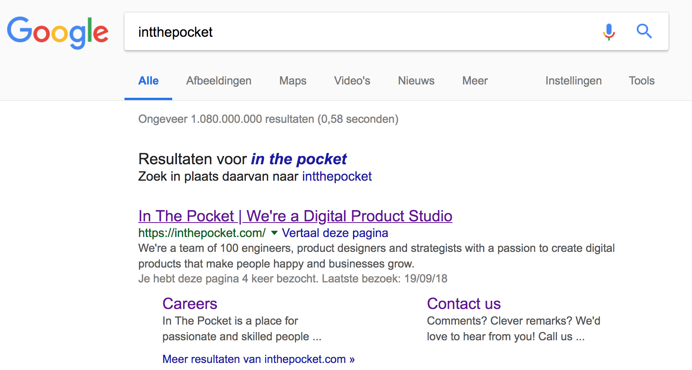
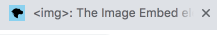

# Head-elementen

::: tip Definitie
Het `<head>`-element is een container voor al de dingen die je wil toevoegen aan een webpagina, die niet worden getoond aan de bezoeker van deze webpagina. Dit element bevat de **meta**gegevens van het HTML-document. **‘Meta’** wil zeggen gegevens over het document zelf: titel, omschrijving, tekenset, stylesheetkoppelingen, ...
:::

::: info Bronnen
- [Mozilla Developer Network: Head element](https://developer.mozilla.org/en-US/docs/Web/HTML/Element/head)
- [Mozilla Developer Network: What’s in the head?](https://developer.mozilla.org/en-US/docs/Learn/HTML/Introduction_to_HTML/The_head_metadata_in_HTML)
:::

## `<title>`-element

::: tip Definitie
Het meest belangrijk SEO-friendly element is het `<title>`-element. Het `<title>`-element bevat een zeer beknopte omschrijving van de website. De lengte hiervan beperken we tot **maximum 80 karakters**, zodat deze niet wordt afgesneden door de zoekmachines tijdens de weergave in de zoekresultaten. Dit element wordt in een zoekmachine als eerste weergegeven na het zoeken van bepaalde inhoud. Het wordt ook getoond als tekst in een tabblad alsook in de bookmarks.
:::

Het `<title>`-element is meestal opgebouwd uit de *titel van de webpagina, subdomein, domein*, bijvoorbeeld: “Start to code \| New Media Development \| Artevelde University of Applied Sciences”. Andere verkiezen een alternatieve indeling:  *domein (merknaam), subdomein en titel van de webpagnia*, bijvoorbeeld: “In The Pocket \| Payconiq x Bancontact x In The Pocket”. Meestal worden de onderdelen binnen een `<title>`-element gescheiden door een verticale streep `|` of een koppelteken `-`.

*[SEO]: Search Engine Optimization (Ned. zoekmachineoptimalisatie)

```html
...
<head>
    <!-- MOST IMPORTANT SEO TAG -->
    <title>HTML Forms | Webtechnology I | New Media Development</title>
</head>
...
```

Na het title-element definiëren we een aantal SEO-friendly meta-elementen in volgorde van belangrijkheid. Deze meta-elementen zijn opgebouwd met twee attributen, namelijk `name` en `content`. In het name-attribuut definiëren we de naam van het `<meta>`-element. Het content attribuut bevat de inhoud van meta-element. 

## `<meta>`-elementen

::: tip Definitie
**Metadata** is data die andere data beschrijft en wordt in HTML via het `<meta>`-element gerealiseerd. Er bestaan verschillende soorten meta-elementen die elk iets anders beschrijven.
:::

::: info Bronnen
- [Mozilla Developer Network: Meta element](https://developer.mozilla.org/en-US/docs/Learn/HTML/Introduction_to_HTML/The_head_metadata_in_HTML#Metadata_the_%3Cmeta%3E_element)
:::

### Set van karakters

::: tip Definitie
Het eerste element onder het `<head>`-element is bijna altijd de definitie van de **set van karakters** *(Eng. character encoding).*
Deze character encoding is belangrijk om de juiste paginaweergave te produceren voor de bezoeker. De character encoding wordt vermeld als waarde van het attribuut `charset`. 
:::

De meest gebruikte set karakters zijn:

- `UTF-8` (Unicode): universele set van karakters, bevat bijna alle karakters uit de mensentaal, zodat bijna alle talen ondersteund worden.
- `ISO-8859-1` (Latin alphabet), de kans is groot dat de rendering van de pagina niet ok is.

```html
<head>
    <meta charset="UTF-8">
</head>
```

### Rendering engines

::: tip Definitie
IE8 en IE9 bevatten verschillende “rendering engines” waardoor het mogelijk is dat een bezoeker, die gebruik maakt van één van deze browsers, niet de laatste “rendering engine” gebruikt. Het meta-element **X-UA-Compatible** laat toe om een “rendering engine” te definiëren. We forceren IE om de meest up-to-date beschikbare “rendering engine” te gebruiken via de instelling: `IE=edge`.
:::

Het `<meta>`-element X-UA-Compatible moet na de character encoding gedefinieerd worden. Volgorde is heel belangrijk in het `<head>`-element. Indien bijvoorbeeld de “encoding” niet gedefinieerd is, dan moet de browser de “encodering” automatisch detecteren. Autodetectie kan soms leiden tot een verkeerde inschatting van de browser, wat kan resulteren in een gebroken pagina.

```html
<head>	
	<!-- CHARACTER ENCODING -->
	<meta charset="UTF-8"> 
	<!-- LATEST VERSION OF RENDERING ENGINE -->
	<meta http-equiv="X-UA-Compatible" content="IE=edge">
</head>
```

::: info Bronnen
- [lifewire: X-UA-Compatible Meta Tag Description and Uses](https://www.lifewire.com/xua-compatible-meta-tag-3469059)
:::

### Omschrijving

De **omschrijving** *(Eng. description)*

::: tip Definitie
Het `<meta>`-element **description** geeft een beknopte omschrijving (Eng. synopsis) over de webpagina. De lengte ervan beperken we tot *maximaal 24 woorden of 250 karakters*. In dit element vertellen we de gebruiker wat we aanbieden via deze webpagina!
:::

```html
...
<head>
	<!-- OTHER IMPORTANT SEO TAGS -->
    <meta name="description" content="Drdynscript wil graag met jullie zijn app en kennis delen over HTML5, CSS3 en JavaScript.">
</head>
...
```

Wanneer we zoeken naar "In The Pocket" via de Google zoekmachine, dan krijgen we als eerste resultaat informatie over de startpagina van de InThePocket website.



In de resultaten merken we per resultaat de volgende onderdelen op:

- De **titel** van de webpagina, inclusief een link naar deze webpagina. In dit geval: "We're a Digital Product Studio - In The Pocket"
- De **URL** van de webpagina.
- De **omschrijving** van de webpagina.

Navigeren we vervolgens naar deze webpagina, via de link, dan kunnen we de bron (Eng. source) van deze pagina bekijken door de **rechtermuistoets** te klikken en vervolgens de optie "inspecteren" (Eng. Inspect) te selecteren. Op deze manier kunnen we o.a. de bron van de webpagina bekijken. We kunnen hierdoor o.a. de title en description bekijken.


### Kernwoorden

De **kernwoorden** *(Eng. keywords)*

::: tip Definitie
 Het volgende belangrijk meta-element zijn de **keywords**. Hierin beschrijven we de webpagina m.b.v. een aantal kernwoorden. Overdrijf hierin niet, want dit kan nadelig zijn voor de rang in zoekresultaten. We beperken ons meestal tot **maximaal 8 kernwoorden** . Deze kernwoorden moeten ook minstens eenmaal voorkomen in de inhoud van deze webpagina. 
:::

 - **Een voorbeeld van de BBC website:**  
"BBC, bbc.co.uk, bbc.com, Search, British Broadcasting Corporation, BBC iPlayer, BBCi".
 - **Een voorbeeld van de In The Pocket website:**  
"virtual reality, mobile development, Mobile applications, Internet of Things, Product design, Development, digital product studio, web development, harald".
 - **Een voorbeeld van de Marlon website:**  
"web, application, design, development, mobile".
 - **Een voorbeeld van de Hyperion website:**  
"web, application, design, development, mobile".

### Auteur

De **auteur(s)** *(Eng. author(s))*

::: tip Definitie
Het meta-element **author** heeft geen invloed op de indexering van de webpagina, toch maakt het deel uit van de meta-element standaarden. In dit meta-element definiëren we de auteurs van de webpagina, dikwijls is dit de eigenaar van de website.
:::

```html
...
<head>
	<!-- OTHER SEO FRIENDLY TAGS -->
    <meta name="author" content="Arteveldehogeschool - Bachelor in de grafische en digitale media | MMP">
</head>
...
```

### Copyright

::: tip Definitie
Het meta-element **copyright** heeft eveneens geen invloed op de indexering. In dit meta-element definiëren we gegevens omtrent de **intellectuele eigendom**. De bescherming van de intellectuele eigendom wordt niet verzekerd door dit meta-element, daarvoor zijn andere middelen noodzakelijk, zoals bijvoorbeeld een disclaimer of privacy statement.
:::

```html
<head>	
	...
	<!-- MOST IMPORTANT SEO TAG -->
	<title>MMP - New Media Design And Development I | HTML5</title>
	<!-- OTHER SEO FRIENDLY TAGS -->	
	<meta name="description" content="Lees hier alles over nieuwe media, html5 en andere ontwikkelingen in webdevelopment en mobile development. De docenten MMP willen graag hun kennis delen met jou!">
	<meta name="keywords" content="HTML5, JavaScript, jQuery, CSS3">
	<meta name="author" content="Arteveldehogeschool - Bachelor in de grafische en digitale media | MMP">
	<meta name="copyright" content="Copyright 2010-19 Arteveldehogeschool. All Rights Reserved.">
	...
</head>
```

### Viewport

::: tip Definitie
Door de toename van mobiele webbrowsers is het aangewezen om een extra meta-element te voorzien, namelijk **viewport**. Wanneer een gebruiker een webpagina bekijkt met een breedte van 960 pixels op een mobiel toestel met een breedte-resolutie van 320 pixels, dan zal deze webpagina visueel verkleind worden zodat dit past binnen deze breedte. De tekst is dan meestal niet meer leesbaar zonder in te zoomen. 
:::

Meestal stellen we als waarde voor dit meta-element **viewport** de waarde `width=device-width` in. De breedte van de viewport zal ingesteld worden op de breedte van het device waarop we de webpagina bekijken. Andere viewport instellingen, zoals `height=device-height`, `initial-scale=1`, … zijn ook toepasbaar, doch niet echt noodzakelijk. De `initial-scale` eigenschap bepaalt het zoomniveau wanneer de pagina wordt geladen. De eigenschap `initial-scale` vermelden we niet in het meta-element viewport omdat dit bugs veroorzaakt op iOS tijdens de rotatie van het toestel. “Rotate/zoom” en “Pinch/zoom” worden hierdoor niet meer negatief beïnvloed en eventuele JS-hacks zijn niet meer noodzakelijk. 

De bijkomende eigenschappen voor het meta-element `viewport: minimum-scale`, `maximum-scale` en `user-scalable` vermelden we ook niet. Deze eigenschappen hebben invloed op de voorkeuren van de gebruiker op hun persoonlijk toestel. Dit gaat regelrecht in tegen de gebruiksvriendelijkheid en toegankelijkheid.

```html
<head>	
	...
	<!-- MOBILE VIEWPORT -->
	<meta name="viewport" content="width=device-width, initial-scale=1, maximum-scale=1">
	...
</head>
```

## Linken van stijlbestanden

::: tip Definitie
Om een website een mooi ogend uiterlijk en gebruiksvriendelijke interface te geven is het natuurlijk noodzakelijk om stijlen te koppelen. Een extern stijlbestand (CSS-file) wordt gekoppeld via het `<link>`-element met waarde `stylesheet` via het `rel`-attribuut en de referentie naar het CSS-bestand via het `href`-attribuut.
:::

Naast het linken van externe stijlbestanden, bij voorkeur, kunnen stijlen ook toegevoegd worden via:

- `<style>`-element
- `style`{:.a}-attribuut
- andere attributen afhankelijk van het element type


Om alle “browser-eigen” html en CSS instellingen te wissen, moeten we deze resetten, beter gekend als normaliseren. Op deze manier kunnen we vertrekken “vanaf 0” voor iedere browser. De meeste browsers geven aan hyperlinks een blauwe kleur en wanneer deze link werd bezocht, wordt de kleur ervan paars. Tabellen krijgen standaard een border en een bepaalde “padding”. De grootte van een lettertype voor de headings h1, h2, … varieert van browser tot browser.  Nog een frappant voorbeeld is de “submit-knop” die in elke browser een ander uiterlijk krijgt. Omwille van deze redenen is een reset-bestand absoluut noodzakelijk.

Veel gebruikte “reset css” bestanden zijn:

- Erick Meyers “Reset CSS” 2.0 
- HTML5 Doctor CSS Reset
- Normalize.css 8.0 
- Universal Selector ‘*’ Reset
- Yahoo (YUI 3) Reset CSS

De keuze tussen deze reset bestanden hangt niet alleen af van de functionaliteit, maar ook van de populariteit. De vorige versie van “Erick Meyers Reset CSS”, die XHTML als doel had, was één van de populairste, maar de nieuwe versie moet zich nog bewijzen en verspreiden.

::: tip
**Normalize.css 8.0** voor HTML5 is voorlopig de meest aanvaarde en populairste "css-reset" optie en gaat verder dan de andere mogelijkheden:
- Gebruiksklare basisstijlen gebaseerd op “best practices”.
- Normaliseren van stijlen voor de meeste elementen. Deze actie wordt ook de andere “css reset” bestanden uitgevoerd.
- Oplossen van bugs voor inconsistenties in de browser.
- Gebruiksvriendelijkheid verhogen.
:::

Normalize houdt ook rekening met de informatie verstrekt door WHATWG, IE UASS en CSS2.1 UASSD, waardoor een uniforme aanpak werd geëxtraheerd voor het oplossen van bugs en het implementeren van basisstijlen. 

*[WHATWG]: Web Hypertext Application Technology Working Group

Downloaden van het normalize.css bestand via:

- <http://necolas.github.io/normalize.css/>
- <https://github.com/necolas/normalize.css/>
- <http://nl.cdnjs.com/libraries/normalize>

::: tip JavaScript-Bibliotheken
- Zoals vele JavaScript-bibliotheken bestaat de aangeleverde versie uit twee typen, namelijk de development-versie en de deployment-versie. De deployment-versie is herkenbaar door het gebruik van "min" in de naamgeving van het bestand. 
- Het verschil tussen een development-versie en een deployment-versie is de bestandsgrootte. In de deployment-versie worden alle commentaren, returns, tabs en spaties verwijderd uit de deployment-versie.
:::

Beide versies bewaren we in de folder `styles/vendor`. We kunnen ook gebruik maken van de CDN[^cdn]-versie van normalize.

Het structureren van de css-bestanden is heel belangrijk om alles te kunnen onderhouden in de toekomst. Sommige designers en developers opteren om de css-bestanden op te delen in:

- `alerts.css`
- `buttons.css`
- `forms.css`
- `helpers.css`
- `layout.css`
- `media.css`
- `navigation.css`
- `pagination.css`
- `tables.css`
- `typograpy.css`

De bovenstaande css-bestanden zijn patronen die we op elke pagina kunnen gebruiken. Basistijlen voor heel de webapplicatie kunnen we best implementeren in een `base.css` bestand. Dit bestand bevat o.a. de header, footer, navigatie en dergelijke. Elke pagina kan daarnaast zijn eigen css-bestand bevatten, bijv.: `home.css`.

```html
<head>
    …
    <link rel="stylesheet" media="all" href="styles/vendor/normalize.css">
    <link rel="stylesheet" media="all" href="styles/base.css">
    <link rel="stylesheet" media="all" href="styles/home.css">
    …
</head>
```

*Alternatieve aanpak linken van stijlbestanden*:

```css
@import url('normalize.css');
@import url('base.css');
/* Continue with page specific styles */
 ```

```html
<head>
    …
    <link rel="stylesheet" media="all" href="styles/home.css">
    …
</head>
```

Het `@import` moet zoveel mogelijk vermeden worden, omdat het eindelijke `home.css` bestand pas geladen zal worden als alle andere `@import` bestanden geladen zijn. Deze werkwijze wordt wel toegepast indien we gebruik maken van CSS-preprocessoren zoals: Less[^less], Sass[^sass] of OOCSS[^oocss].


## Linken van scriptbestanden

Voor de meeste front-end webapplicaties linken we slechts twee JavaScript bestanden in het head-element, namelijk HTML5Shiv en Modernizr JS-bestand.

**HTML5Shiv** is een JS-bibliotheek om stijlen toe te passen op HTML5 elementen, die in oudere IE versies (lager dan IE9) niet herkend worden. Deze bibliotheek is ook gekend als HTML5Shim. Het verschil tussen HTML5Shiv en HTML5Shim zit enkel in de naam, de laatste letter wijkt enkel af van elkaar. 

 Een “shim” is een bibliotheek om compatibiliteitsproblemen  voor oudere applicaties op te lossen door een laag te voorzien tussen de nieuwe code of standaarden  en de oudere code. Op deze manier kunnen oudere applicaties ook genieten van nieuwere technologieën . 

Deze bibliotheek kan worden gedownload via http://code.google.com/p/html5shiv/. Dit bestand plaatsen we onder `components/html5shiv/` of `scripts/vendor/`. 

```html
<head>
	...
	<!--[if lt IE 9]>
	<script src="scripts/vendor/html5shiv.js"></script>
	<![endif]-->
</head>
```

Enkel als de gebruiker IE8 browser gebruikt, moet het `html5shiv.js` bestand uitgevoerd worden. Vandaar dat we deze code omsluiten in een conditionele commentaar. We plaatsen deze code best na het linken van stijlbestanden, waardoor we een betere performantie zullen hebben. 

**Modernizr** is een JavaScript-bibliotheek die de eigenschappen van de browser van de cliënt detecteert en toelaat om stijlen toe te passen op HTML5 elementen in IE8 of lager (HTML5Shiv). We kunnen hiermee de volgende eigenschappen detecteren:

- CSS3;
- HTML5;
- Geolocatie;
- SVG[^svg] ;
- SMIL[^smil] ;
- Touch Events;
- WebGL[^webgl] 
- … en andere eigenschappen via plugins[^modernizrplugins] 

Traditioneel werden de functionaliteiten opgevraagd via de “User Agent ” via de `navigator.userAgent` eigenschap, een erg onbetrouwbare manier. Modernizr maakt het eenvoudiger om conditionele JavaScript en CSS te schrijven voor browsers die bepaalde functionaliteit niet ondersteunen. Indien de browser van de gebruiker een bepaalde functionaliteit niet ondersteunt, moeten we voor deze gebruiker terugvallen  op instrumenten die een gelijkaardige functionaliteit bevat. 

Modernizr laadt snel tijdens het laden van de webpagina, in dit laadproces detecteert het de eigenschappen van de browser van de gebruiker, creëert daarnaast een Modernizr JavaScript object met de resultaten van de detectie en voegt tenslotte de noodzakelijke klassen toe aan het “html” root element.

Het gedownload Modernizr-bestand voegen we toe in de `components/modernizr/` of `scripts/vendor/` folder. Net boven het sluiten van het head-element voegen we een script-element toe die verwijst naar het Modernizr-bestand. 

In HTML5 moet het script-element enkel een `src` attribuut bevatten of moet er code aanwezig zijn tussen de open –en sluit-tag van het script-element. Dus de definitie van het type-attribuut is niet meer noodzakelijk zoals we vroeger implementeerden via `type="text/javascript"`.  Standaard worden scripts in de head-sectie van een webpagina direct uitgevoerd voordat een browser verdergaat met het doorlopen (parsen) van deze webpagina. Het is ook mogelijk om deze scripts op een andere manier te laden via de attributen:

- `defer="defer"`
Het script wordt pas uitgevoerd nadat de browser heel de webpagina doorlopen heeft.
- `async="async"`
Het script wordt asynchroon uitgevoerd met de rest van de webpagina. Het wordt dus uitgevoerd terwijl de browser verder de pagina doorloopt.

```html
<head>
    …
    <script src="scripts/vendor/modernizr.custom.js"></script>
</head>
```

Omdat Modernizr direct uitgevoerd moet worden, zullen we deze attributen niet toevoegen. Het volstaat dus om enkel het src-attribuut in te vullen met als waarde het pad naar het Modernizr JS-bestand. Via de downloadpagina[^modernizrdownload] kunnen we de features selecteren die we wensen te gebruiken in onze webapplicatie. Hoe meer features geselecteerd, hoe groter het Modernizr JS-bestand zal zijn. Indien we helemaal nog niet weten welke features we nodig hebben, kunnen we gebruik maken van de development-versie.

<script></script>

## Speciale elementen in  `<head>`

### Iconen

Iconen worden gebruikt om een logo of een ander grafisch object weer te geven in het url-veld of adresveld van een browser en ook in het favorieten menu van deze browser, na het toevoegen van een bookmark van deze webpagina. Ook kunnen webpagina’s toegevoegd worden op mobiele toestellen binnen de lijst van apps of binnen de lijst van favoriete bookmarks. Google Chrome laat daarnaast ook toe om een snelkoppeling te maken op het bureaublad, startmenu en/of de taakbalk.

Voor desktop-browsers gebruiken we een favicon meestal standaard met een resolutie van 16x16 pixels. Hogere resoluties zijn mogelijk afhankelijk van de bandbreedte en de hogere resolutieschermen. Iconen hebben in Windows ook verschillende formaten:

- 16x16 (256) in de control box, taskbar, Add/Remove Programs en Folder Browse dialog
- 32x32 (256) Notify Icon, Desktop Shortcut
- 48x48 (256) Desktop Shortcut

Omwille van deze formaten is het aan te raden om zo’n favicon aan te maken met verschillende resoluties: 16x16, 32x32, 48x48, ... pixels. Een favicon heeft de extensie `.ico`. Het aanmaken van zo’n icoon kunnen we m.b.v. Photoshop, Microsoft Paint, andere grafische IDE’s of door conversie van een bestaande afbeelding naar een ico-afbeelding via convertico, xiconeditor of andere online webapplicatie.




### Humans.txt

Het "humant.txt” bestand is een bestand, dat onder de root wordt geplaatst van de webapplicatie, waarin we o.a. de mensen, die meegewerkt hebben aan de webapplicatie, kenbaar maken. De inhoud van zo’n bestand bevat voorlopig geen standaard, maar er zijn wel een aantal richtlijnen  omschreven door Abel Cabans[^humanstxt]. 

We kunnen het “humans.txt” bestand ook expliciet linken in het head-element via een link-element met de attributen: type (waarde: tekst/plain), rel (waarde: author) en href (pad naar het human.txt bestand). Dit element plaatsen bij voorkeur net boven de “Open Graph” meta elementen.

```html
<head>
	...
	<link rel="author" type="text/plain" href="/humans.txt">
	...
</head>
```

Het **humans.txt** bestand bestaat minstens uit drie secties:

- **TEAM**
    Persoon die een grote bijdragen hebben geleverd aan de website. Voor elke persoon vermelden we zijn/haar titel, naam, website, woonplaats en eventuele andere links naar sociale media. We vermelden geen emailadressen.  Een algemeen emailadres van het bedrijf of website mag wel vermeld worden.
- **THANKS**
    Personen die een kleine bijdrage of ondersteuning hebben geleverd, vermelden we onder de sectie “THANKS”.  We vermelden tenminste de naam en eventueel in een paar woorden een omschrijving van de bijdrage of ondersteuning
- **SITE**
    In de “SITE” sectie vermelden we datum van de laatste update, de gebruikte standaarden, gebruikte componenten en software, algemeen emailadres, ...


Voorbeeld `humans.txt`-bestand:

```
/* TEAM */
Company: Arteveldehogeschool
Website: http://www.arteveldehs.be
Twitter: @ArteveldeHS
Email: info [at] arteveldehs [dot] be
Location: Ghent, Belgium

Data+Design+HTML+CSS+PHP+MySQL+jQuery: Philippe De Pauw - Waterschoot
Website: http://www.drdynscript.org
Twitter: @drdynscript
Location: Ghent, Belgium


/* THANKS */
HTML5 Template: Boilerplate
Website: http://html5boilerplate.com/


/* SITE */
Last update: Always up-to-date
Standards: HTML5, CSS3
Components: Modernizr, jQuery, Google Maps
Software: PHP, MySQL, Sublime Text, Notepad++
```

Hierboven is een voorbeeld uitgewerkt voor het “humans.txt” bestand. Andere voorbeelden zijn te bekijken op <http://humanstxt.org/humans/>. 

`humans.txt` van <http://www.bitbucket.com/humans.txt>:

```
Greetings, Internet ninja.

You see a puff of smoke. You've entered Bitbucket.

Wanna help out? https://www.atlassian.com/company/careers/
```

`humans.txt` van <http://html5boilerplate.com/humans.txt>:

```
# humanstxt.org/
# The humans responsible & technology colophon

# TEAM

    Rob Larsen -- @roblarsen
    Mathias Bynens -- @mathias
    Hans Christian Reinl -- @drublic
    Christian Oliff -- @coliff

# PAST TEAM MEMBERS:

    Cătălin Mariș -- @alrra
    Nicolas Gallagher -- @necolas
    Paul Irish -- @paul_irish
    Divya Manian -- @divya

# THANKS

    Mickael Daniel -- @mklabs

# TECHNOLOGY COLOPHON

    CSS3, HTML5
    Gulp, HTML5 Boilerplate, Normalize.css

    Source: https://github.com/h5bp/html5boilerplate.com
```

### Open Graph

==Nog in the vullen.==

## Bestanden onder de root van de webapplicatie

Courante bestanden die onder de root zijn gebracht:

- `.htaccess` (Apache, Nginx)
- `404.html`
- `crossdomain.xml`
- `humans.txt` (Medewerkers die meegedragen hebben tot deze webapplicatie. Software / Bibliotheken / Hardware / Cloud services die werden gebruikt om deze webapplicatie succesvol te voltooien)
- `index.html` (Startpagina)
- `robots.txt` (Indexering van de webapplicatie door zoekmachines)
- `sitemap.xml`
- `Web.config` (IIS)

### Robots.txt

::: tip Definitie Web Robot  
Een **Web Robot** is een zelfstandig programma dat automatisch het web doorzoekt.
:::

 Zoekmachines, zoals Google, Bing en Yahoo gebruiken deze robots om webinhoud te indexeren. Webinhoud zijn niet alleen webpagina’s, maar ook afbeeldingen, video’s en andere assets. Robots worden ook gebruikt als “spam” hulpmiddel om bijvoorbeeld emailadressen te scannen en ook om advertenties te zoeken. “Chat bots” zijn robots die mettertijd conversaties met de mens hebben geleerd. Er bestaan zelfs zeer geavanceerde “chat bots” die zich compleet als mens gedragen in normale conversaties. 

In vroegere dagen hielden zoekmachines rekening met een aantal meta-tags om zich te leiden binnen een website voor de indexering ervan. Via de meta-tag `name="revisit-after"`, verplichten we de zoekmachines deze webpagina terug te bezoeken na een aantal opgegeven dagen. Via het content-attribuut kunnen we het aantal dagen opgeven. Meestal vermelden we `1` als waarde voor dit content attribuut. Dit betekent dat de zoekmachines deze webpagina elke dag zullen bezoeken! Via de meta-tag `name="robots"` konden we het indexeren van de website een bepaalde richting geven, kortom leiden doorheen de website. 

Sommige webpagina’s willen we vermelden in de zoekmachines, andere niet. Soms willen we dat de zoekmachine enkel de links bekijkt binnen een webpagina en niet de webpagina zelf. Deze voorkeuren konden we realiseren via deze meta-tag door bepaalde opgelegde waarden te vermelden in het content attribuut. Mogelijke waarden: 

- `Index` -- De webpagina indexeren.
- `Noindex`-- De webpagina niet indexeren.
- `Follow` -- De links op deze webpagina volgen.
- `Nofollow` -- De links op deze webpagina niet volgen. 

Meestal gaven we aan de voorgaande meta-tag de waarde index, follow. De moderne zoekmachines houden echter geen rekening meer met deze meta-tags. Het leiden van de zoekmachines moeten we nu realiseren d.m.v. een **robots.txt** bestand. Kortom een robots.txt bestand *geeft instructies over de website aan webrobotten*. Deze robotten worden gebruikt om de website te indexeren. Dit bestand plaatsen we onder root van de webapplicatie.  

Het robots.txt tekstbestand is ontwikkeld om bepaalde resources te beschermen tegen indexering, zodat bepaalde delen niet zichtbaar zijn in zoekresultaten. Deze conventie is ook gekend onder de begrippen: “Robot Exclusion Standard”, “Robot Exclusion Protocol” of “robots.txt protocol”. In dit bestand laten we de publieke resources toe, maar niet privé resources, zoals: backoffice, oauth, api's, tijdelijke folders en andere resources die de snelheid van de globale applicatie in het gedrang brengen door veelvuldig bezoek. 

De meest belangrijke elementen binnen het robots.txt bestand zijn:

- `User-agent`  
  De user-agent is de naam van de browser of robot die bij elke nieuwe http request wordt meegestuurd. De versie en naam van de user-agent worden bewaard in logbestanden, zodat we hiervan de traffic kunnen bekijken en eventueel analyses kunnen uitvoeren ter bevordering van de veiligheid en SEO .
- `Allow`  
  Het toelaten van bepaalden paden voor indexering. Disallow betekent het niet toelaten van bepaalde secties of paden.
- `Wildcards`  
  Het **asterisk** (`*`) symbool definieert een wildcard. Een wildcard specifieert een aantal karakters in de URL paden. Het laat toe om bepaalde patronen te definiëren. 
- `Sitemap locatie`  
  Sitemaps[^sitemaps] zijn lijsten van URL’s in XML formaten met bijkomende informatie, zoals laatste aanpasdatum , ... Om de publieke en dus ook toegankelijke hiërarchische structuur van een website aan deze robots kenbaar te maken, wordt expliciete toegang verleend aan het “sitemap.xml” bestand binnenin dit “robots.txt” bestand. Deze registratie heeft een positieve invloed op de zoekmachineoptimalisatie. 
- `IP Authenticatie` 
Het toelaten van robots uit bepaalde IP blokken. Hierdoor beletten we dat ongeoorloofde robots enorm veel requests per seconden versturen zonder de richtlijnen uit het “robots.txt” bestand te volgen.

De volgorde waarin we de regels definiëren is onbelangrijk binnen een “robots.txt” bestand. Er zijn heel wat robots  die we kunnen gebruiken als naam voor de user-agent. Toch kunnen we voor indexering ons beperken tot de grote drie zoekmachines, namelijk: Google, Bing en Yahoo. De belangrijkste Google robots zijn: “Googlebot”, “Googlebot-Image” en “Googlebot-mobile”. De laatste twee robots volgen de regels gedefinieerd voor de Googlebot, maar kunnen ook hun eigen regels bevatten. De twee belangrijkste Bing[^bing] robots zijn: “BingBot” en “MsnBot”. Indien we geen “BingBot” definiëren, zal deze robot de regels van de “MsnBot” volgen. De belangrijkste Yahoo robot is Yahoo! Slurp.

Voorbeeld `robots.txt` bestand:
```
User-agent: *
Disallow: /_styles/
Disallow: /_scripts/
Disallow: /backoffice/
Disallow: /account/
Disallow: /search/
Sitemap: /sitemap.xml
```
 **Uitleg voorbeeld robots.txt:**
 
 - Alle user-agents worden toegelaten.
 - De folder waarin stijlbestanden zitten, inclusief assets niet worden toegelaten.
 - De folder waarin scriptbestanden zitten, niet worden toegelaten.

Om de robots.txt tekstbestanden te bekijken van andere websites, volstaat het om de domeinnaam te gebruiken gevolgd door “robots.txt”, bijvoorbeeld: http://www.een.be/robots.txt. 

`robots.txt` van <https://www.showpad.com/robots.txt>:

```txt
User-agent: *
Disallow: /wp-admin/
Allow: /wp-admin/admin-ajax.php
Disallow: /*.pdf
Sitemap: https://www.showpad.com/sitemap_index.xml
```

`robots.txt` van <https://www.inthepocket.mobi/robots.txt>:

```
# robots.txt for https://inthepocket.com/

Sitemap: https://inthepocket.com/sitemap.xml

# Don't allow web crawlers to index Craft

User-agent: *
Disallow: /craft/
```

```
robots.txt van http://www.facebook.com:

 Notice: Crawling Facebook is prohibited unless you have express written
 permission. See: http://www.facebook.com/apps/site_scraping_tos_terms.php

User-agent: baiduspider
Disallow: /ajax/
Disallow: /album.php
Disallow: /checkpoint/
Disallow: /contact_importer/
Disallow: /feeds/
Disallow: /file_download.php
Disallow: /l.php
Disallow: /p.php
Disallow: /photo.php
Disallow: /photo_comments.php
Disallow: /photo_search.php
Disallow: /photos.php
Disallow: /sharer/
...
```

### Sitemap.xml

Sitemaps[^sitemapssyntax] informeren zoekmachines over de webpagina’s uit de website die geïndexeerd kunnen worden.  Een sitemap voor een website wordt gedefinieerd in een **sitemap.xml** bestand. Dit bestand wordt bijna altijd geplaatst onder de root van de webapplicatie. Indien de website verschillende sitemaps bevat, zullen we deze sitemaps verwijzen in een hoofdsitemap voor de gehele website. In de eenvoudigste vorm is een sitemap een XML bestand dat een lijst bevat van URL’s. Iedere URL bevat additionele informatie, zoals: laatste aanpasdatum, frequentie van de wijzigingen, de belangrijkheid van deze URL, ... 

Een eenvoudige **sitemap** bestaat uit:

- Na de xml declaratie begint het xml document met de `<urlset>`-tag en eindigt met de `</urlset>`-tag. De namespace wordt via het attribuut xmlns beschreven.
- Voor elke URL die we toevoegen aan de sitemap vermelden we een `<url>`-tag.
- Binnen deze tag definiëren we de `<loc>`-tag. Hierin voegen we de URL toe van een webpagina.
- Daarnaast zijn nog optionele tags mogelijk, zoals: `<lastmod>` (laatste aanpasdatum in het formaat YYYY-MM-DD), `<changefreq>` (frequentie van paginawijzigingen: always, hourly, daily, weekly, monthly, yearly, never), `<priority>` (De prioriteit van een URL relatief t.o.v. andere URL’s binnen de website, default waarde: `0.5`). Het toekennen van prioriteiten aan webpagina’s hebben geen invloed op de positie in de resultatenpagina’s van een zoekmachine.
- De URL’s die we vermelden moeten “URL-escaped en encoded ” zijn om leesbaar te zijn voor de webserver.

sitemap.xml van http://www.arteveldehogeschool.be/sitemap.xml:

```xml
<?xml version="1.0" encoding="UTF-8"?>
```