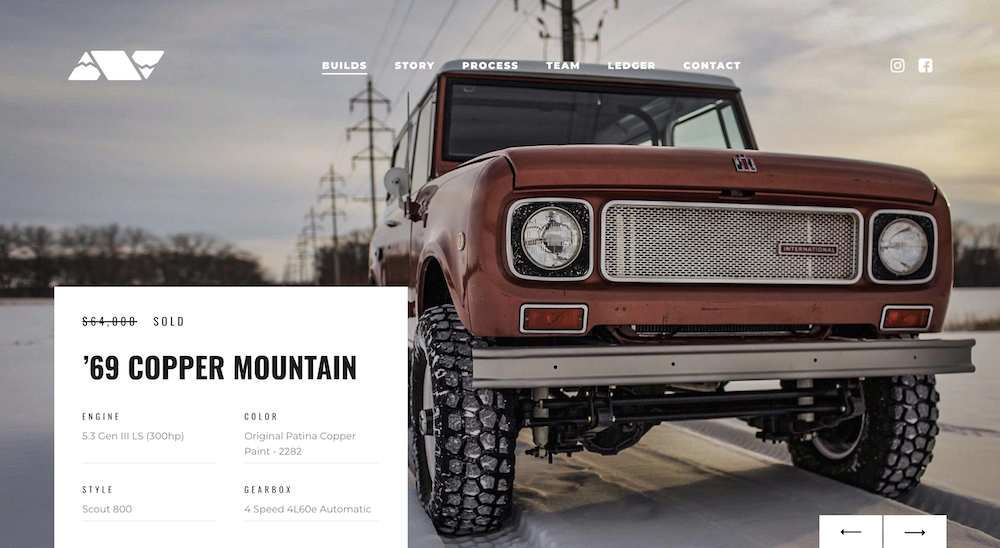
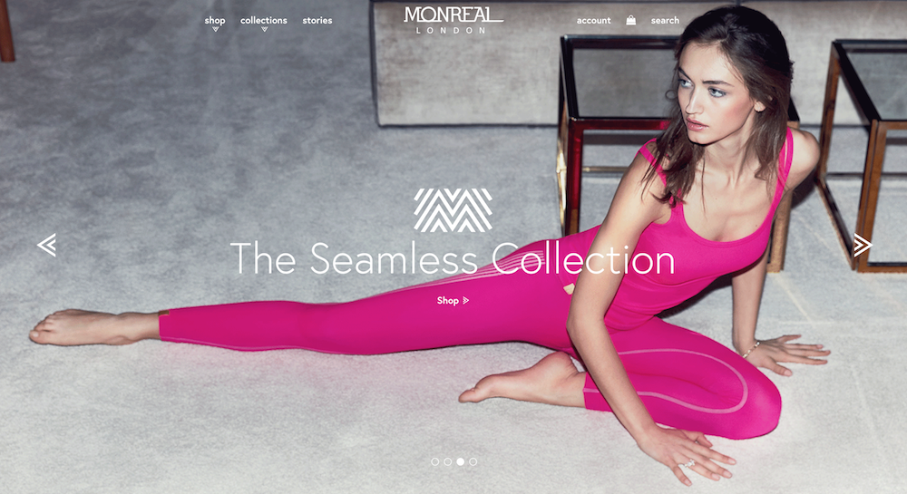
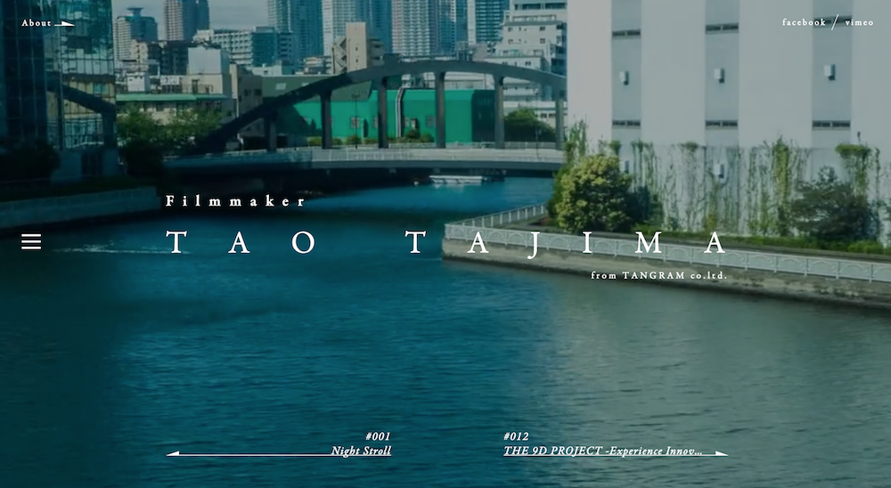
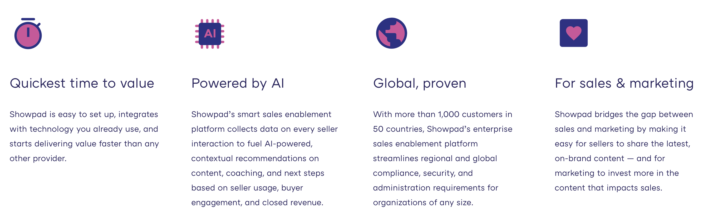
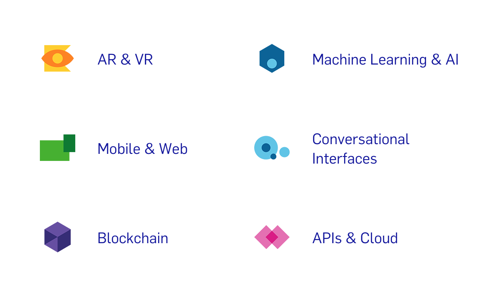

# Afbeeldingen

De meeste mensen geven de **voorkeur aan afbeeldingen** in vergelijking met tekst. Een website zonder afbeeldingen wordt door de meeste mensen ervaren als saai ook als is het een attractief design. Het lezen van veel tekst vraagt van de gebruiker tijd en moeite. Afbeeldingen zijn innemend en kunnen allerlei soorten van **emoties en herinneringen triggeren**. Ze kunnen ook beter gememorizeerd en gedeeld worden dan tekst en doorbreekt beter een taalbarrière.

Er zijn meerdere redenen om afbeeldingen toe te voegen aan een webpagina:

- Merk (Eng. Brand) als logo, favicon en touch-icons
- Intro-afbeelding die het bedrijf en/of product weergeeft
- Illustraties die bepaalde diensen (Eng. services) visueel ondersteunen
- Afbeeldingen die een preview geven van een product of dienst
- Weergave van teamleden
- Iconen die contactinformatie herkenbaarder maken
- ...

De volgende markupelementen hebben te maken met afbeeldingen:

- Afbeeldingen
  - ``
  - `<figure>`
  - `<figcaption>`
  - `<picture>`
  - `<source>`
- GraphicsShow
  - `<svg>`
  - `<canvas>`

### Logo's


### Intro afbeeldingen







### Illustraties





## Image

**Im**a**g**e *(Ned. Afbeeldig)*

::: tip Definitie  
Het ``-element wordt gebruikt om een afbeelding te plaatsen op een webpagina. Het bronbestand wordt opgegeven met een `src`-attribuut *(Eng. source).
:::

We kunnen als waarde van dit attribuut de volgende waarden vermelden:

- **absolute koppeling**;
  - via `http`of `https`;
  - bv.: `http://www.gdm.gent/trots/assets/projects/fit-challenge/screen-designs-02.png` 
- **relatieve koppeling**;
  - betekent t.o.v. de plaats van het huidige webdocument;
  - bv.: `./assets/images/detail1_VanHoeckeJulie.png`;  
  `assets`-folder staat op dezelfde plaats dan het webdocument. `images` is een submap van de map `assets`. Het bestand `detail1_VanHoeckeJulie.png` is een afbeelding ondergebracht in deze laatste map.
- **gegevens-URI**.  
Integratie van de echte gegevens van de afbeelding. Zonder koppeling gewoon de pure data. We vermelden het type, de tekenset *(Eng. tekenset),* de codering *(Eng. encoding)* en tenslotte de gecodeerde gegevens *(Eng. encoded data).*

Naast het `src`-attribuut bevat een afbeelding altijd het `alt`-attribuut en meestal het `title`-attribuut.  

Het `alt`-attribuut is van belang wanneer de bron van de afbeelding niet geladen kan worden of voor slechtziende personen. Het `alt`-attribuut staat voor **alternate text** of alternatieve tekst. Bij verkeerde bron wordt de waarde van dit attribuut getoond. Daarnaast is dit attribuut en ook de waarde ervan belangrijk voor slechtzienden. De waarde geeft een indicatie of synopsis van wat er te zien is op de afbeelding, maar niet in detail.  

De waarde van het `title`-attribuut specifieert extra informatie over de afbeelding en wordt meestal visueel getoond in een tooltip.

```html

```

In het bovenstaande voorbeeld definiëren we een afbeelding via het ``-element, identificeren we deze via het `class`-attribuut met een specifieke waarde `artist__image`, vermelden we de bron van de afbeelding met als waarde een absolute url van het `src`-attribuut, het `alt`-attribuut en tenslotte het `title`-attribuut. We merken op dat de waarde van het `title`-attribuut extra toelichting geeft over de afbeelding.

| Attibuut | Waarde                | Betekenis                                                                                                                               |
| :------- | :-------------------- | :-------------------------------------------------------------------------------------------------------------------------------------- |
| `src`    | `absolute koppeling`  | Bevat zowel het protocol, domeinnaam, aanvullend pad en/of bestandsnaam. <br>Vb:  `http://lorempixel.com/400/200/sports/1`              |
|          | `relatieve koppeling` | Ten opzichte van de plaats van het huidig webdocument<br>Vb: `./assets/images/detail1_VanHoeckeJulie.png`                               |
|          | `gegevens-URI`        | Pure data: het type, de tekenset de codering en de gecodeerde gegevens<br>Vb: `data:image/gif;base64,R0lGODlhEAA … jIQA7`               |
| `alt`    | `alternatieve tekst`  | De waarde verschijnt in de browser als de afbeelding niet kan getoond worden. <br>Waarde kan ook gebruikt worden door `screen readers`. |
| `title`  | `aanvullende tekst`   | Beschrijft de afbeelding, de waarde van `title` wordt getoond in een tooltip.                                                           |


::: info Bronnen
- [Mozilla Developer Network: Image element](https://developer.mozilla.org/en-US/docs/Web/HTML/Element/img)
 :::

## Figure

**Figure** *(Ned. figuur)*

::: tip Definitie  
Het `<figure>`-element wordt gebruikt om één of meerdere illustraties (afbeeldingen, video's, codeblokken, svg, canvas …) te omsluiten die op zichzelf kunnen bestaan ongeacht de inhoud die er rond staat. De gebruiker moet via dit element al voldoende weten over de inhoud van deze illustratie(s). Dit element groepeert gelijksoortige illustraties als een zelf voorziene eenheid. Dit betekent dat we dit element ook op andere plaatsen binnen een website kunnen plaatsen.
:::

Child-elementen:

 - ``
 - `<figcaption>`

Het `<figure>`-element bevat voor een afbeelding minimaal één ``-element of `<picture>`-element en wordt meestal aangevuld met maximaal één `<figcaption>`-element.

```html
<figure>
  
  <figcaption>
    Bazart is een indie-popgroep uit België. De band maakt Nederlandstalige muziek. Bazart werd opgericht door zanger Mathieu Terryn en zanger/gitarist Simon Nuytten. Naar eigen zeggen probeert de band kleinkunst in de Vlaamse betekenis populair te maken onder het Belgische publiek. Bazart werd genomineerd voor zeven MIA's in 2016 en verzilverde er vijf: "Hit van het jaar", "Beste Nederlandstalig", "Beste doorbraak", "Beste pop" en "Beste groep".
  </figcaption>
</figure>
```

In het bovenstaande voorbeeld hebben we een synopsis toegevoegd via het `<figcaption>`-element omtrent de groep Bazart. Het `<figcaption>`-element geeft een bijschrift over de illustratie(s). De inhoud hiervan geeft nog meer extra toelichting dan het `title`-attribuut van het embedded ``-element. Sommige ontwikkelaars laten soms hierdoor het `title`-attribuut achterwegen, ze zien dit als overbodig. 

Met het `<figure>`-element wordt code semantisch beter gestructureerd. Het bakent een visuele asset met een bijschrijft af. Het `<figure>`-element kan ook **middelen** *(Eng. assets)* groeperen die hetzelfde bijschrift *(Eng. caption)* bevatten, bv. een slideshow van afbeeldingen om een portfolio visueel te kaderen.

```html
<figure>
  
  
  
  
  
  
  <figcaption>
    Line-up Rock Werchter on Saturday 07-10-1017.
  </figcaption>
</figure>
```

In het bovenstaande voorbeeld groeperen we artiesten en/of bands die spelen op dezelfde avond op een rockfestival. In het `<figcaption>`-element maken we duidelijk wanneer deze artiesten spelen tijdens het festival. Het `<figure>`-element kan dienst doen als slideshow of als een oplijsting van artiesten die spelen op deze specifieke dag.

Willen we nog uitgebreide toelichting geven aan iedere artiest in het bovenstaande voorbeeld, dan kunnen we iedere afbeelding omsluiten door een `<figure>`-element met bijhorend `<figcaption>`-element.

```html
<figure>
  <figure>
    
    <figcaption>
      Bazart is een indie-popgroep uit België. De band maakt Nederlandstalige muziek. Bazart werd opgericht door zanger Mathieu Terryn en zanger/gitarist Simon Nuytten. Naar eigen zeggen probeert de band kleinkunst in de Vlaamse betekenis populair te maken onder het Belgische publiek. Bazart werd genomineerd voor zeven MIA's in 2016 en verzilverde er vijf: "Hit van het jaar", "Beste Nederlandstalig", "Beste doorbraak", "Beste pop" en "Beste groep".
    </figcaption>
  </figure>
  ...
  <figcaption>
    Line-up Rock Werchter on Saturday 07-10-1017.
  </figcaption>
</figure>
```

::: info Bronnen
- [Mozilla Developer Network: Figure element](https://developer.mozilla.org/en-US/docs/Web/HTML/Element/figure)
- <https://www.sitepoint.com/quick-tip-the-right-way-to-use-figure-and-figcaption-elements/>
- <http://www.anysurfer.be/nl/blog/detail/html5-figure-en-figcaption>
- <https://www.w3.org/WAI/tutorials/images/groups/>
:::

## Picture

::: tip Definitie  
Het `<picture>`-element wordt gebruikt om meerdere versies van een afbeelding aan te bieden. Afhankelijk van het display van een device wordt een bepaalde versie van de afbeelding geactiveerd.
:::

- Een descendant van `<body>`
- Child-elementen:
- `<source>`
- ``

```html
<picture>
    <source media="(min-width: 650px)" srcset="./images/donald_duck.png">
    <source media="(min-width: 465px)" srcset="./images/goofy.png">
    <source srcset="./images/mickey_mouse.png">
    
</picture>
```

In bovenstaand voorbeeld zal een afbeelding van Donald Duck getoond worden als de viewport minstens 650px is. Bij kleinere schermformaten (groter dan of gelijk aan 465px maar kleiner dan 650px) wordt Goofy getoond. Indien de viewport nog kleiner is, zal Mickey Mouse verschijnen. De img-tag staat er als fallback indien de browser de `<picture`-tag niet ondersteunt.

::: info Bronnen
- [Mozilla Developer Network: Picture element](https://developer.mozilla.org/en-US/docs/Web/HTML/Element/picture)
- [Mozilla Developer Network: Source element](https://developer.mozilla.org/en-US/docs/Web/HTML/Element/source)
:::

## Bestandsformaten

| Formaat                                                                | Uitspraak     | Best geschikt voor                                                                                          |
| ---------------------------------------------------------------------- | ------------- | ----------------------------------------------------------------------------------------------------------- |
| [GIF](https://en.wikipedia.org/wiki/Graphics_Interchange_Format)       | Jif of Djif   | Animaties                                                                                                   |
| [JPEG](https://en.wikipedia.org/wiki/JPEG)                             | Jay-Peg       | Foto's                                                                                                      |
| [PNG](https://en.wikipedia.org/wiki/Portable_Network_Graphics)         | Ping          | Illustraties met veel kleurherhaling of foto's met transparantie                                            |
| [APNG](https://developer.mozilla.org/en-US/docs/Animated_PNG_graphics) | Animated Ping | Geanimeerde illustraties met veel kleurherhaling of foto's met transparantie (voorlopig enkel voor Mozilla) |
| [SVG](https://developer.mozilla.org/en-US/docs/SVG)                    | S-V-G         | Illustraties, iconen voor hoogresolutieschermen                                                             |

Niet geschikte beeldformaten voor websites:

- [BMP](https://en.wikipedia.org/wiki/BMP_file_format): Bitmap, een rasterafbeelding zonder compressie.
- [TIFF](https://en.wikipedia.org/wiki/TIFF): Tagged Image File Format

::: danger Opgelet
De gemiddelde webpagina is 3 tot 4 MB groot met alle afbeeldingen inbegrepen. Probeer hieronder te blijven, tenzij er een heel goede reden voor is (bijv. website van een fotograaf met heel veel kwalitatieve foto's).
:::