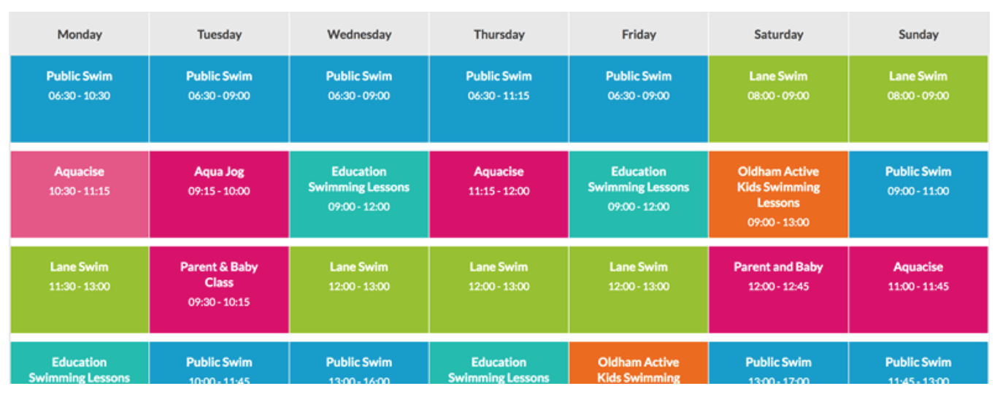

# Tabellen

## Tabulaire data

In [Microsoft Excel](https://products.office.com/en-us/excel) is een goed voorbeeld van software dat werkt met tabulaire data of "table data". Deze data is gestructureerd m.b.v. rijen en kolommen. Excel laat toe om de data te exporteren naar CSV[^CSV]. CSV is al redelijk oud en wordt nog dikwijls gebruikt als de standaard voor tabulaire data.

::: tip Definitie  
CSV staat voor Comma-seperated values of character-seperated values.
:::

CSV wordt vaak omschreven als "Tabular data in plain text vorm". Bevat geen algemene standaard, maar een paar suggesties worden aangeboden via [RFC4180](https://tools.ietf.org/html/rfc4180). CSV bestaat uit een verzameling van **records** (rijen) gescheiden door een **line break** of iets gelijkaardigs. Meestal hebben alle records hetzelfde aantal velden. Ieder record bestaat uit een aantal velden gescheiden door een **comma** of iets gelijkaardigs, bijv: tab, `;` , ...

Het CSV-formaat is beschikbaar in vele applicaties via import/export functionaliteiten. Incompatibele programma’s kunnen via CSV data met elkaar uitwisselen, bijv.: export van gegevens uit een databank en vervolgens import van deze gegevens via CSV in een spreadsheet.

[^CSV]: CSV: Comma Seperated Values.

### Syntax

Enkele vooropgestelde regels om CSV op te stellen:

- **plain text** gebruik makend van een characterset, zoals: ASCII en **Unicode**;
- bestaat uit records, meestal één record per regel;
- een record wordt onderverdeeld in velden;
- de velden worden gescheiden via een delimiter of separator;
- elk record bestaat uit hetzelfde aantal velden.

Deze regels zijn weliswaar niet vastgelegd in een standaard, maar worden toch algemeen aangenomen.

### Voorbeeld(en)


::: info Bronnen
- [FRICTIONLESS DATA: CSV - Comma Separated Values](http://frictionlessdata.io/docs/csv/)
- [Wikipedia: Comma Separated Values](http://en.wikipedia.org/wiki/Comma-separated_values)
- [IETF: RFC4180](http://tools.ietf.org/html/rfc4180)
:::


## `<table>`-element

::: tip Definitie  
Het `<table>`-element representeert tabulaire (Eng. tabular) data, dat is informatie dat beschreven is een twee dimensionale (Eng. two-dimensional) tabel (cfr. array) bestaande uit rijen (Eng. rows) en kolommen (Eng. columns). Een tabel laat toe om snel en eenvoudig waarden op te zoeken op basis van een correlatie tussen kolommen en rijen, bv: leeftijd van een persoon, dag van de week, ... .
:::

| HTML-element | Betekenis                                                                               |           |
| ------------ | --------------------------------------------------------------------------------------- | --------- |
| `<table>`    | tabel                                                                                   |           |
| `<tr>`       | *table row*, tabelrij                                                                   |           |
| `<td>`       | *table data*, tabelgegevenscel                                                          |           |
| `<th>`       | *table heading*, tabelkopcel                                                            |           |
| `<thead>`    | *table head row group*                                                                  | 1         |
| `<tbody>`    | *table body row group*                                                                  | 1 of meer |
| `<tfoot>`    | *table foot row group*                                                                  | 1         |
| `<colgroup>` | *group of columns within the table*                                                     | 1         |
| `<col>`      | *column within the colgroup*<br>definiëren van gelijke semantiek op specifieke kolommen | 1 of meer |
| `<caption>`  | *table caption*<br>toelichting van de tabel                                             | 1         |


The HTML `<colelement>` defines a column within a table and is used for defining common semantics on all common cells. It is generally found within a `<colgroupelement>`.

Een cel ( `<td>` of  `<th>`) heeft een aantal optionele attributen.

| HTML-attribuut | Waarde        | Betekenis                                   |
| -------------- | ------------- | ------------------------------------------- |
| `colspan`      | `«aantal»`    | de cel overspant een `«aantal»`**kolommen** |
| `rowspan`      | `«aantal»`    | de cel overspant een `«aantal»`**rijen**    |
| `scope`        | `row`of `col` | visuele associatie                          |


### Gebruik

- Agenda (academische kalender, ...)
- Planning
- Schedule (symposium, workshops, ...)
- Product vergelijkingen
- Nieuwsbrief (e-mailbericht)
- Backoffice



::: danger Opgelet
**Nooit** tabellen gebruiken voor de lay-out van een webpagina! Tabellen voor lay-out zorgt voor een **zeer complexe** structuur die moeilijk te beheren valt. Daarnaast is het heel moeilijk om de webpagina responsive te maken. Tenslotte zullen [screenreaders](https://developer.mozilla.org/en-US/docs/Learn/Tools_and_testing/Cross_browser_testing/Accessibility#Screenreaders) het moeilijk hebben om de structuur / inhoud te interpreteren.
:::

### Structuur

```html
<table>
  <thead>
    <tr>
      <th colspan="3">Table Header</th>
    </tr>
  </thead>
  <tbody>
    <tr>
      <td>Column 1</td>
      <td>Column 2</td>
      <td>Column 3</td>
    </tr>
  </tbody>
  <tfoot>
    <tr>
      <td colspan="3">Table Footer</td>
    </tr>
  </tfoot>
</table>
```

```css
table {
    border-collapse: collapse;
}
td,
th {
    border: 1px solid rgb(190, 190, 190);
    padding: 10px;
}

td {
    text-align: center;
}

tr:nth-child(even) {
    background-color: #eee;
}
```


::: info Bronnen
- [Mozilla Developer Network: Table element](https://developer.mozilla.org/en-US/docs/Web/HTML/Element/table)
- [Mozilla Developer Network: Basics](https://developer.mozilla.org/en-US/docs/Learn/HTML/Tables/Basics)
- [UX Design: Design better Data tables](https://uxdesign.cc/design-better-data-tables-4ecc99d23356)
- [Mozilla Developer Network: border-collapse](https://developer.mozilla.org/en-US/docs/Web/CSS/border-collapse)
:::