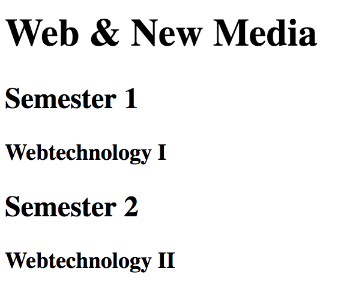
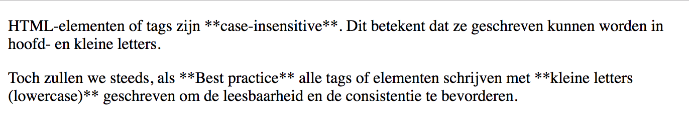
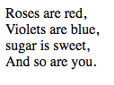

# Tekst

## Heading

De **H**eading *(Ned. kop).*

::: tip Definitie
Een heading-element omschrijft kort het onderwerp over de sectie die het introduceert.
:::

Zoekmachines gebruiken de headings om de structuur en inhoud van een webpagina te indexeren. Heading geeft in HTML de koppen van een tekst weer. Dit gaat van kop 1 tot kop 6, kop 1 is de belangrijkste tot kop 6 de minst belangrijke. 

Er zijn **6 niveaus** van koppen:

 1. `<h1>`… `</h1>`: niveau 1 is het **meest** belangrijk.
 2. `<h2>`… `</h2>`
 3. `<h3>`… `</h3>`
 4. `<h4>`… `</h4>`
 5. `<h5>`… `</h5>`
 6. `<h6>`… `</h6>`: niveau 6 is het **minst** belangrijk.

```html
<body>
  <h1>Web &amp; New Media</h1>
  <h2>Semester 1<h2>
  <h3>Webtechnology I<h3>
  <h2>Semester 2<h2>
  <h3>Webtechnology II<h3>
</body>
```

Dit resulteert visueel in:



Dit resulteert in de volgende outline of structuur:

- 1\. Web & New Media
  - 1.1 Semester 1
    - 1.1.1 Webtechnology I
  - 1.2 Semester 2
    - 1.2.1 Webtechnology II

::: warning Opmerking
- Heading-elementen zijn blokelementen.
- Sla geen niveau over.
- Gebruik niet de lagere niveau's om de lettergrootte aan de passen, daarvoor dient [CSS](../../../styles/css).
- Heading-informatie wordt gebruikt door [user agents](https://nl.wikipedia.org/wiki/Useragent) om een inhoudsopgave (Eng. Table of contents) te genereren van de webpagina.
- Bezoekers scannen meestal eerst de headings om een beknopt verhaal te kennen. Wekt dit hun interresse op, dan lezen ze meer.
:::

::: info Bronnen
- [Mozilla Developer Network: Heading elements](https://developer.mozilla.org/en-US/docs/Web/HTML/Element/Heading_Elements)
:::

## Paragraph

**P**aragraph *(Ned. paragraaf, alinea)*

::: tip Definitie
`<p>`… `</p>`groepeert zinnen die bij elkaar horen.
:::

```html
<body>
  <p>
    HTML-elementen of tags zijn **case-insensitive**. Dit betekent dat ze geschreven kunnen worden in hoofd- en kleine letters.
  </p>
  <p>
    Toch zullen we steeds, als **Best practice** alle tags of elementen schrijven met **kleine letters (lowercase)**   
    geschreven om de leesbaarheid en de consistentie te bevorderen. 
  </p>
</body>
```

Dit resulteert visueel in:




::: info Bronnen
- [Mozilla Developer Network: The Paragraph element](https://developer.mozilla.org/nl/docs/Web/HTML/Element/p)
:::

## Italic

**I**talic *(cursief)*

::: tip Definitie  
 `<i>` … `</i>` wordt gebruikt om tekst cursief te zetten, zonder speciale betekenis.
:::

::: warning Opmerking
- Vermijd dit element!
- Je gebruikt beter `<em>`of CSS!
:::

```html
<body>
  <p>
    HTML-elementen of tags zijn <i>case-insensitive</i>. Dit betekent dat ze geschreven kunnen worden in hoofd- en kleine letters.
  </p>
</body>
```

Dit resulteert visueel in:


::: info Bronnen
- [Mozilla Developer Network: i](https://developer.mozilla.org/en-US/docs/Web/HTML/Element/i)
 :::

## Emphasis

**Em**phasis *(Ned. nadruk)*

::: tip Definitie
`<em>`… `</em>`wordt gebruikt om een nadruk te leggen op bepaalde woorden.
:::

- De standaardopmaak is schuin.

::: info Bronnen
- [Mozilla Developer Network: The Strong Importance element](https://developer.mozilla.org/en-US/docs/Web/HTML/Element/em)
:::

## Bold

**B**old *(Ned. vet)*

::: tip Definitie
`<b>`… `</b>`Wordt gebruikt om tekst vet te zetten, zonder speciale betekenis.
:::

::: danger Opgelet
- Vermijd dit element!
- Je gebruikt beter `<strong>` of CSS!
:::

::: info Bronnen
- [Mozilla Developer Network: b: The Bring Attention To element](https://developer.mozilla.org/en-US/docs/Web/HTML/Element/b)
:::

## Strong Importance

**Strong** importance *(Ned. sterke nadruk)*

::: tip Definitie  
`<strong>`… `</strong>`wordt gebruikt om sterke nadruk te leggen op bepaalde woorden.
:::

 - De standaardopmaak is vet.

::: info Bronnen
- [Mozilla Developer Network: The Strong Importance element](https://developer.mozilla.org/en-US/docs/Web/HTML/Element/strong)
:::

## Code

**Code** *(Ned. programmeercode)*

::: tip Definitie  
`<code>` … `</code>` Wordt gebruikt om code in de inhoud te zetten.
:::

- Een descendant van `<body>`
- Standaard wordt een monospace lettertype gebruikt.

```html
<code>&lt;meta&gt;</code>
```

Dit resulteert visueel in:

<code>&lt;meta&gt;</code>

::: info Bronnen
- [Mozilla Developer Network: code: The Inline Code element](https://developer.mozilla.org/en-US/docs/Web/HTML/Element/code)
:::

## Preformatted Text

**Pre**formatted text *(Ned. voorgeformatteerde tekst)*

::: tip Definitie  
`<pre>` … `</pre>` wordt gebruikt om de witruimte van voorgeformatteerde tekst te behouden.
:::

`<pre>`… `</pre>`

- Een descendant van `<body>`
- Standaard wordt een monospace lettertype gebruikt.


## Abbreviation

**Abbr**eviation *(Ned. afkorting)*

::: tip Definitie  
`<abbr>` … `</abbr>` wordt gebruikt om een afkorting te verklaren. De verklaring wordt getoond via het `title`-attribuut als je over het `<abbr>`-element hovert.
:::

`<abbr>`… `</abbr>`

- Een descendant van `<body>`

```html
<abbr title="Hypertext Markup Language">HTML</abbr>
```

## Line Break

Line **br**eak *(Ned. regeleinde)*

::: tip Definitie  
`<br>`-element geeft een regeleinde weer in een tekst. De tekst zal op de volgende lijn starten.
:::

`<br>`
 - Is een descendant van `<body>`
 - Zelfsluitende tag.

```html
<p>
  Roses are red,<br>
  Violets are blue,<br>
  sugar is sweet,<br>
  And so are you.<br>
</p>
```

Dit resulteert visueel in:



::: warning Opmerking
Gebruik dit zo weinig mogelijk!
:::

::: danger Opgelet
Gebruik dit element **nooit** om tekst te schikken, want daar moet je CSS voor gebruiken.
:::

::: info Bronnen
- [Mozilla Developer Network: The Line Break element](https://developer.mozilla.org/en-US/docs/Web/HTML/Element/br)
:::


## Horizontal ruler

**H**orizontal **r**uler *(Ned. horizontale lijn)*

::: tip Definitie  
`<hr>` wordt gebruikt om een **thematic break** *(Ned. veranderend onderwerp)* tussen paragraafelementen (`<p>`) aan te geven.
:::

`<hr>`

 - Een descendant van `<body>`
 - Zelfsluitende tag.

## HTML Character Entities

::: tip Definitie  
Soms worden speciale tekens niet goed afgebeeld. Entiteiten worden gebruikt om die gereserveerde tekens, die door HTML anders worden geïnterpreteerd, weer te geven. 
:::

 - Gebruik UTF-8 als tekenset (zie `<meta charset="UTF-8">`)
 - Indien dat niet helpt, gebruik dan **Escape Characters**

| Teken | Entity     | Betekenis                                   |
| :---: | :--------- | :------------------------------------------ |
|  `<`  | `&lt;`     | **l**ess **t**han                           |
|  `>`  | `&gt;`     | **g**reater **t**han                        |
|  `à`  | `&agrave;` |                                             |
|  `ç`  | `&ccedil;` |                                             |
|  `é`  | `&eacute;` |                                             |
|  `ê`  | `&ecirc;`  |                                             |
|  `è`  | `&egrave;` |                                             |
|  `ë`  | `&euml;`   |                                             |
|  `ï`  | `&iuml;`   |                                             |
|  `€`  | `&euro;`   | **euro** sign                               |
|  `&`  | `&amp;`    | **amp**ersand                               |
|  `×`  | `&times;`  | vermenigvuldigingsteken                     |
|  `…`  | `&hellip;` | **H**orizontal **ellip**sis (beletselteken) |

::: info Bronnen
- [Mozilla Developer Network: Entity](https://developer.mozilla.org/en-US/docs/Glossary/Entity)
- [Officiële lijst met entiteiten](https://dev.w3.org/html5/html-author/charref)
:::