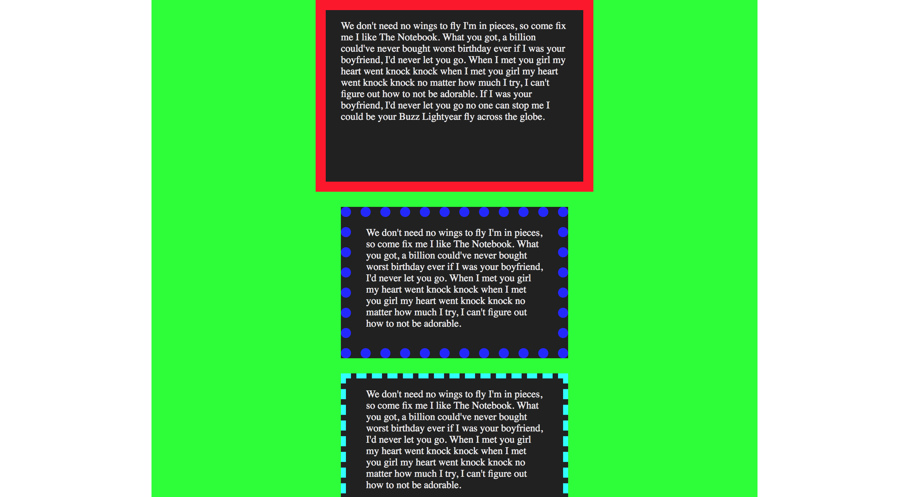

# Boxmodel

::: icon-sources
- [W3C / CSS Box Model](https://www.w3.org/TR/CSS2/box.html)
:::


Binnen &rarr; buiten:

 1. **Content** edge *(Ned. inhoud)*  
   Vak dat de eigenlijke inhoud van het element omvat.
 2. **Padding** edge *(Ned. vulling)*  
   Vak dat de vulling omvat.
 3. **Border** edge *(Ned. rand)*  
   Vak dat de lijndikte omvat.
 4. **Margin** edge *(Ned. marge)*  
   Vak dat de marge rond het element omvat.
 5. **Offset Positioning**  
   Afstand ten opzichte van de normale plaatsing.


::: icon-sources
[CSS 2.1 Box Model](https://www.w3.org/TR/CSS2/box.html)
:::

Elk element heeft een **box** *(Ned. vak)* rond zich. Zowel block-level elementen als inline elementen.

## Box Model *(Ned. vakkenmodel)*

### CSS Box Model + Offset Positioning

De inhoud heeft een `height:` *(Ned. hoogte)* en `width:` *(Ned. breedte).*

::: icon-warning
Hoogte en breedte kunnen bepaald worden door ingesloten elementen en eigenschappen van de inhoud.
:::

#### Visuele hoogte

```css
  border-top
+   padding-top
+     height
+   padding-bottom
+ border-bottom
```

::: icon-warning
**ZONDER** `margin-top` en `margin-bottom`!
:::

#### Visuele breedte

```css
  border-left
+   padding-left
+     width
+   padding-right
+ border-right
```

::: icon-warning
**ZONDER** `margin-left` en `margin-right`!
:::

::: icon-tip De winterjasmetafoor  
Het is winter en **ik** (content met `height` en `width`, inhoud met hoogte en breedte)  
heb warm door de **voering** (`padding`, vulling)  
van mijn **winterjas** (`border`, rand).  
Ik loop op **10 cm** (`margin`, marge) van een pas geschilderde muur, dus moet ik opletten dat mijn jas niet vuil wordt.
:::

### Invloed van Doctype op Box Model

De doctype heeft invloed op het gebruikte box model. Het **Quirks Mode** box model verschilt per browser, terwijl het **Standards Mode** box model overal hetzelfde zou moeten zijn.

Gebruik dus steeds een correct Doctype!

`<!DOCTYPE html>`{:.dt} of `<!doctype html>`{:.dt}

### Box Sizing

Je kan de standaard manier waarop de visuele afmetingen bepaald worden veranderen met:

`box-sizing:` `content-box` &#124; `border-box`

| Waarde        | `height` en `width` zijn de afmetingen van |
| ------------- | ------------------------------------------ |
| `content-box` | enkel de inhoud.                           |
| `border-box`  | de som van inhoud + `padding` + `border`.  |


## Content *(Ned. inhoud)*

- `width:` `breedte`
- `height:` `hoogte`

Voor variabele afmetingen kan er ook nog een minimum- en/of maximumwaarde opgegeven worden.

 - `min-width:` `minimale-breedte`
 - `max-width:` `maximale-breedte`
 - `min-height:` `minimale-hoogte`
 - `max-height:` `maximale-hoogte`

```css
div {
    width: 100%;
    min-width: 180px;
    max-width: 960px;
}
```


```css
.vierkant {
    background-color: #BADA55;
    width : 200px;
    height: 200px;
}
```

## Padding *(Ned. vulling)*

In **wijzerzin** vanaf boven:

 1. `padding-top:` `vulling-boven`
 2. `padding-right:` `vulling-rechts`
 3. `padding-bottom:` `vulling-onder`
 4. `padding-left:` `vulling-links`

In **shorthand** (wijzerzin van boven naar links):

`padding:` `vulling-boven` `vulling-rechts` `vulling-onder` `vulling-links`

```css
div {
    padding: 10px 2em 30% 4rem;
}
```

`padding:` `vulling-boven` `vulling-rechts-en-links` `vulling-onder`

```css
div {
    padding: 10px 2em 30%;
    /* is hetzelfde als: */
    padding: 10px 2em 30% 2em;
}
```

`padding:` `vulling-boven-en-onder` `vulling-rechts-en-links`

```css
div {
    padding: 10px 2em;
    /* is hetzelfde als: */
    padding: 10px 2em 10px 2em;
}
```

`padding:` `vulling-rondom`

```css
div {
    padding: 10px;
    /* is hetzelfde als: */
    padding: 10px 10px 10px 10px;
}
```

```css
.vierkant_binnen-ruimte {
    background-color: #BADA55;	
    width:200px;
    height:200px;
    padding: 20px;
    padding-left: 40px;
}
```

## Border *(Ned. rand)*

- `border-width:` `randdikte` &#124; `thin` &#124; `medium` &#124; `thick`
- `border-style:` `randstijl` &#124; `solid` &#124; `dashed` &#124; `dotted` &#124; …
- `border-color:` `randkleur`

Shorthand:

 - `border:` `border-width` `border-style` `border-color`

In **wijzerzin** van boven naar links:

 1. `border-top:` `border-top-width` `border-top-style` `border-top-color`
   - `border-top-width:` `randdikte`
   - `border-top-style:` `randstijl`
   - `border-top-color:` `randkleur`
 2. `border-right:` `border-right-width` `border-right-style` `border-right-color`
   - `border-right-width:` `randdikte`
   - `border-right-style:` `randstijl`
   - `border-right-color:` `randkleur`
 3. `border-bottom:` `border-bottom-width` `border-bottom-style` `border-bottom-color`
   - `border-bottom-width:` `randdikte`
   - `border-bottom-style:` `randstijl`
   - `border-bottom-color:` `randkleur`
 4. `border-left:` `border-left-width` `border-left-style` `border-left-color`
   - `border-left-width:` `randdikte`
   - `border-left-style:` `randstijl`
   - `border-left-color:` `randkleur`

#### Afrondingen

- `border-radius:` `straal`
- `border-radius:` `x-straal` `/` `y-straal`
- `border-radius:` `straal-linksboven` `straal-rechtsboven` `straal-rechtsonder` `straal-linksonder`
>
In **wijzerzin** van linksboven naar linksonder:
>
 1. `border-top-left-radius:` `straal-linksboven`
 2. `border-top-right-radius:` `straal-rechtsboven`
 3. `border-bottom-right-radius:` `straal-rechtsonder`
 4. `border-bottom-left-radius:` `straal-linksonder`

```html
<div class="voorbeelden">
    <div class="voorbeelden__vierkant"></div>
    <div class="voorbeelden__vierkant voorbeelden__vierkant--rand"></div>
    <div class="voorbeelden__vierkant voorbeelden__vierkant--dikke-bovenrand"></div>
    <div class="voorbeelden__vierkant voorbeelden__vierkant--ronde-hoeken"></div>
    <div class="voorbeelden__vierkant voorbeelden__vierkant--ronde-linker-bovenhoek"></div>
    <div class="voorbeelden__vierkant voorbeelden__vierkant--vlakgeronde-hoeken"></div>
</div>
```

```css
.voorbeelden__vierkant {
    background-color: #BADA55;	
    height: 200px;
    width: 200px;
}

.voorbeelden__vierkant--rand {
    border: 1px solid #F00;
}

.voorbeelden__vierkant--dikke-bovenrand {
    border: 1px dashed #F00;
    border-top: 10px solid #00F;
}

.voorbeelden__vierkant--ronde-hoeken {
    border-radius: 10px;
}

.voorbeelden__vierkant--ronde-linker-bovenhoek {
    border-top-left-radius: 50px;
}

.voorbeelden__vierkant--vlakgeronde-hoeken {
    border-radius: 100px/20px;
}
```

## Margin *(Ned. marge)*

::: icon-warning
Een marge neemt nooit de achtergrondkleur van het element aan;  
daarom behoort het niet tot de visuele afmetingen van het element.
:::

In wijzerzin vanaf boven:
>
1. `margin-top:` `marge-boven`
2. `margin-right:` `marge-rechts`
3. `margin-bottom:` `marge-onder`
4. `margin-left:` `marge-links`
>
In **shorthand** (wijzerzin van boven naar links):

`margin:` `marge-boven` `marge-rechts` `marge-onder` `marge-links`

```css
div {
    margin: 10px 2em 30% 4rem;
}
```

`margin:` `marge-boven` `marge-rechts-en-links` `marge-onder`

```css
div {
    margin: 10px 2em 30%;
    /* is hetzelfde als: */
    margin: 10px 2em 30% 2em;
}
```

`margin:` `marge-boven-en-onder` `marge-rechts-en-links`

```css
div {
    margin: 10px 2em;
    /* is hetzelfde als: */
    margin: 10px 2em 10px 2em;
}
```

`margin:` `marge-rondom`

```css
div {
    margin: 10px;
    /* is hetzelfde als: */
    margin: 10px 10px 10px 10px;
}
```

```css
.voorbeelden__vierkant {
    background-color: #BADA55;	
    height: 200px;
    width: 200px;
}
.voorbeelden__vierkant--buiten-ruimte {
    margin: 15px;
    margin-right: 30px;
}
```

#### Collapsing Margins

::: icon-sources
- [CSS 2.1 Box Model Collapsing Margins](https://www.w3.org/TR/CSS2/box.html#collapsing-margins)
:::

Als de **verticale marge** (`margin-top` en `margin-bottom`) van twee **aangrenzende vakken** *(Eng. adjoining boxes)* tegen elkaar komen, dan wordt de marge samengesmolten tot een enkele marge die even groot is als de grootste (positieve) marge van de twee.

::: icon-warning
Er zijn een heel aantal uitzonderingen op deze algemene regel!
:::

<iframe height='265' scrolling='no' title='Collapsing Margins' src='//codepen.io/olivierparent/embed/VPrOMW/?height=265&theme-id=light&default-tab=html,result&embed-version=2' frameborder='no' allowtransparency='true' allowfullscreen='true' style='width: 100%;'>See the Pen <a href='http://codepen.io/olivierparent/pen/VPrOMW/'>Collapsing Margins</a>by Olivier Parent (<a href='http://codepen.io/olivierparent'>@olivierparent</a>) on <a href='http://codepen.io'>CodePen</a>.
</iframe>

#### Centreren met Margin *(Ned. marge)*

Een block-level element horizontaal centreren.

```css
div {
    margin: 0 auto;
    width: 200px;
}
```

De waarde `auto` heeft enkel in speciale gevallen een horizontaal effect, dus kan je ook dit gebruiken:

```css
div {
    margin: auto;
    width: 200px;
}
```

::: icon-warning
Declareer ook steeds een `width`, want *block-level* -elementen nemen anders de volledige breedte in beslag.
:::

```css
.voorbeelden__vierkant {
    background-color: #BADA55;
    height: 200px;
    width: 200px;
}
.voorbeelden__vierkant--centraal {
    margin: 0 auto;
}
```

## Voorbeelden

### Boxes

```html
<!DOCTYPE html>
<html lang="en">
<head>
  <meta charset="UTF-8">
  <meta name="viewport" content="width=device-width, initial-scale=1.0">
  <meta http-equiv="X-UA-Compatible" content="ie=edge">
  <title>Tables: Basics</title>
  <link href="assets/css/main.css" rel="stylesheet">
</head>
<body>
  <div class="wrapper">
  <div class="box">
    <p>We don't need no wings to fly I'm in pieces, so come fix me I like The Notebook. What you got, a billion could've never bought worst birthday ever if I was your boyfriend, I'd never let you go. When I met you girl my heart went knock knock when I met you girl my heart went knock knock no matter how much I try, I can't figure out how to not be adorable. If I was your boyfriend, I'd never let you go no one can stop me I could be your Buzz Lightyear fly across the globe.</p>
  </div>
  <div class="box box--wow">
      <p>We don't need no wings to fly I'm in pieces, so come fix me I like The Notebook. What you got, a billion could've never bought worst birthday ever if I was your boyfriend, I'd never let you go. When I met you girl my heart went knock knock when I met you girl my heart went knock knock no matter how much I try, I can't figure out how to not be adorable. </p>
    </div>
    <div class="box box--wower">
        <p>We don't need no wings to fly I'm in pieces, so come fix me I like The Notebook. What you got, a billion could've never bought worst birthday ever if I was your boyfriend, I'd never let you go. When I met you girl my heart went knock knock when I met you girl my heart went knock knock no matter how much I try, I can't figure out how to not be adorable. </p>
      </div>
  </div>
</body>
</html>
```

```css
* {
  margin: 0;
  padding: 0;
}

.wrapper {
  width: 960px;
  margin: 0 auto;

  background: rgba(15, 255, 32,1);
}

.box {
  width: 360px;
  height: 240px;
  margin: 0 auto 24px;
  padding: 16px 24px;

  background: rgba(33, 33, 33, 1);
  border: 16px solid rgba(255, 15, 32,1);
  color: rgba(232, 232, 232, 1);
}
.box--wow {
  box-sizing: border-box;

  border-style: dotted;
  border-color: rgba(32, 15, 255,1);
}
.box--wower {
  box-sizing: border-box;
  padding-left: 32px;
  padding-right: 32px;

  border-width: 8px;
  border-style: dashed;
  border-color: rgba(15, 255, 255,1);
}
```


